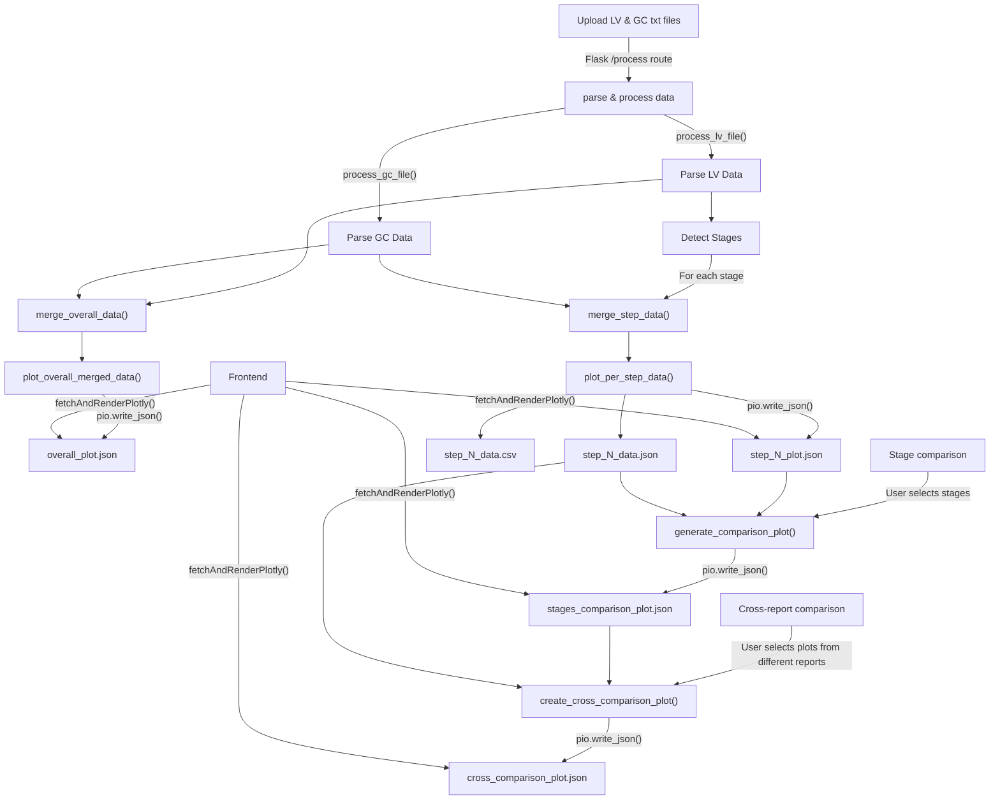
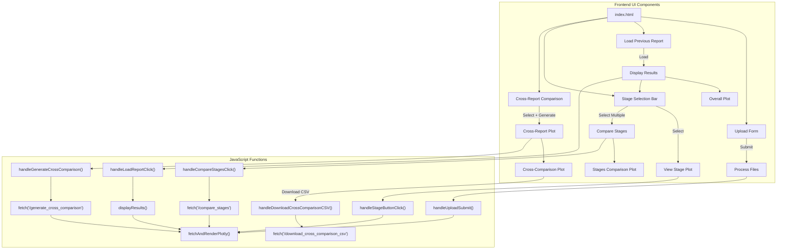
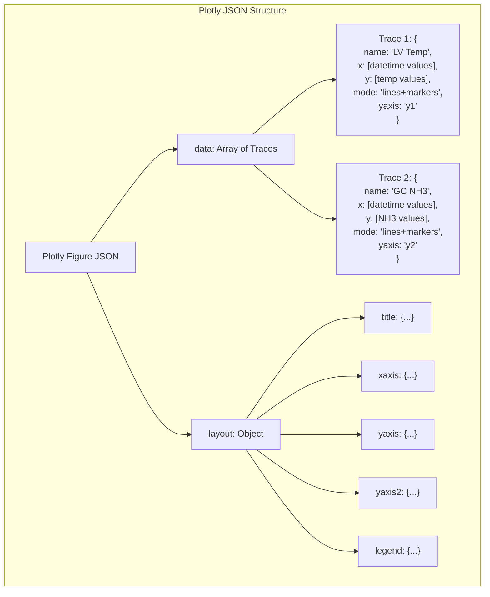

# LV & GC Data Processing Web Interface

This project provides a web interface for processing and visualizing data from LabVIEW (LV) and Gas Chromatography (GC) text files.

## Table of Contents

- [Features](#features)
- [Data Flow and Architecture](#data-flow-and-architecture)
  - [Overall Data Processing Flow](#overall-data-processing-flow)
  - [Cross-Comparison Data Flow](#cross-comparison-data-flow)
  - [Frontend UI Components](#frontend-ui-components)
  - [Plotly JSON Structure](#plotly-json-structure)
- [Technical Implementation Details](#technical-implementation-details)
  - [Data Processing Pipeline](#data-processing-pipeline)
  - [Frontend Visualization System](#frontend-visualization-system)
  - [Comparison Features Implementation](#comparison-features-implementation)
- [Detailed Data Processing](#detailed-data-processing)
  - [LV Data Processing](#lv-data-processing)
  - [GC Data Processing](#gc-data-processing)
  - [Data Merging and Correlation](#data-merging-and-correlation)
  - [Plotly Visualization Generation](#plotly-visualization-generation)
- [Code Examples](#code-examples)
  - [Cross-Report Comparison Implementation](#cross-report-comparison-implementation)
- [Project Structure](#project-structure)
- [Usage](#usage)
  - [Starting the Application](#starting-the-application)
  - [Processing Data Files](#processing-data-files)
  - [Detailed User Workflow](#detailed-user-workflow)
  - [Sample Input File Format](#sample-input-file-format)
- [FAQ (Frequently Asked Questions)](#faq-frequently-asked-questions)
  - [General Questions](#general-questions)
  - [Technical Questions](#technical-questions)
  - [Data Output Questions](#data-output-questions)
- [Troubleshooting](#troubleshooting)
  - [Common Issues](#common-issues)
  - [Development and Extension](#development-and-extension)
  - [System-Specific Issues](#system-specific-issues)
- [License](#license)
- [Acknowledgments](#acknowledgments)

## Features

*   Upload LV and GC data files (`.txt` format).
*   Processes data, merges based on timestamps, and detects experimental stages based on `RelativeTime` in the LV file.
*   **Custom Report Name Prefix:** Allows users to specify a text prefix (e.g., an experiment name) for the generated report folder, resulting in folder names like `MyExperiment_YYYYMMDD_HHMMSS`.
*   Generates an overall analysis plot and CSV file combining data from both sources.
*   Generates individual plots, CSV, and JSON data files for each detected stage.
*   Provides download links for all generated plots and data files through the web interface.
*   Allows selecting specific stages to download a combined CSV of their data.
*   Interactive plots in the browser using Plotly.js.
*   **Load Previous Reports:** Users can select and reload previously processed reports from a dropdown list, restoring all plots and data links.
*   **Stage Comparison:** Within a loaded report, users can select multiple stages and generate a comparative plot showing their Temperature and NH3 data against Relative Time.
*   **Cross-Report Comparison:** 
    *   Users can select `stages_comparison_plot_*.json` files from different previously generated reports.
    *   Users can also select individual stages from the *currently loaded* report.
    *   A new combined plot is generated, overlaying traces from all selected sources (previous comparison plots and current stages).
    *   Trace names in the cross-comparison plot are prefixed with their report source (e.g., "ReportTimestamp - Stage X - Parameter" or "Current (ReportTimestamp) - Stage Y - Parameter").
    *   Cross-comparison plots are saved in a dedicated `static/reports/cross_comparisons/` subfolder.
*   Outputs are organized into timestamped folders within `static/reports/`.

## Data Flow and Architecture

### Overall Data Processing Flow



### Cross-Comparison Data Flow

```mermaid
flowchart TD
    subgraph "Cross-Comparison Data Flow"
        A1["User selects comparison plots<br/>from previous reports"] --> A2["Selected JSON paths stored<br/>in selectedCrossReportJsonPaths array"]
        A3["User selects stages<br/>from current report"] --> A4["Stage numbers stored<br/>in currentReportSelectedStages array"]
        A2 --> A5["handleGenerateCrossComparison()"]
        A4 --> A5
        A5 -->|"POST /generate_cross_comparison"| A6["Server-side processing"]
        
        subgraph "Server-side Processing"
            B1["create_cross_comparison_plot()"] --> B2["Create new Plotly figure"]
            B2 --> B3["Process each selected JSON file"]
            B3 --> B4["Extract source info from path"]
            B4 --> B5["Add traces with source prefix"]
            B2 --> B6["Process each stage from current report"]
            B6 --> B7["Load stage data from JSON"]
            B7 --> B8["Add traces with 'Current' prefix"]
            B8 --> B9["Write combined plot to JSON file"]
        end
        
        A6 --> B1
        B9 --> A7["Response with plot_json_path"]
        A7 --> A8["fetchAndRenderPlotly()"]
        A8 --> A9["Plot rendered in crossComparisonPlotDiv"]
        A9 --> A10["User clicks 'Download Visible Plot Data'"]
        A10 --> A11["handleDownloadCrossComparisonCSV()"]
        A11 --> A12["Extract visible data points<br/>from rendered plot"]
        A12 --> A13["POST to /download_cross_comparison_csv"]
        A13 --> A14["CSV file download initiated"]
    end
```



### Frontend UI Components



### Plotly JSON Structure



## Technical Implementation Details

### Data Processing Pipeline

1. **File Upload and Initial Processing**:
   * Text files are uploaded through a web form and temporarily stored in the `uploads/` directory
   * `process_lv_file()` reads the LV file, handling the specific format with metadata in the first lines
   * `process_gc_file()` reads the GC file with a different format
   * Both functions convert appropriate columns to numeric types and handle datetime conversions

2. **Stage Detection**:
   * The application automatically detects experimental stages by monitoring drops in the `RelativeTime` column of the LV data
   * Each time `RelativeTime` decreases, a new stage is identified and marked with an incremental stage number

3. **Data Merging**:
   * `merge_overall_data()` combines LV and GC data using `pd.merge_asof()` with a configurable time tolerance
   * `merge_step_data()` creates stage-specific datasets by filtering and merging the relevant portions of data

4. **JSON Plotly Generation**:
   * For each dataset (overall and per stage), a corresponding Plotly visualization is created
   * Multiple y-axes are configured for different parameter types (temperature, pressure, flows, NH3)
   * The complete Plotly figure objects (data and layout) are serialized to JSON format using `plotly.io.write_json()`
   * JSON format enables client-side rendering and interactivity without requiring server-side plotting capabilities

### Frontend Visualization System

1. **Plot Rendering**:
   * The frontend uses the `fetchAndRenderPlotly()` function to load JSON plot files from the server
   * Plot styling is dynamically adjusted based on the user's theme preference (light/dark)
   * Plotly.js handles the rendering of interactive plots with features like zooming, panning, and hover information

2. **Theme Management**:
   * The application supports both light and dark themes with theme-specific color schemes
   * When switching themes, all visible plots are automatically re-rendered with updated color schemes
   * Theme preferences are stored in localStorage for persistence between sessions

3. **Report Management**:
   * Reports are listed in reverse chronological order for easy access to recent experiments
   * Report folders can be renamed, deleted, or their contents viewed directly from the interface
   * The entire folder structure follows a consistent pattern for predictable file paths

### Comparison Features Implementation

1. **Stage Comparison**:
   * The `generate_comparison_plot()` function loads data from selected stage JSON files
   * Creates a new plot with common x-axis (RelativeTime) to overlay data from multiple stages
   * Color-codes different stages and parameters for easy visual comparison

2. **Cross-Report Comparison**:
   * `create_cross_comparison_plot()` combines data from:
     - Existing comparison plots from previous reports
     - Individual stages from the currently loaded report
   * Source information is prefixed to trace names for clear identification
   * The generated plot is saved in a dedicated cross-comparison folder structure

3. **CSV Export for Comparison Data**:
   * The visible data points from cross-comparison plots can be exported to CSV
   * Only data points within the current plot view are included in the export
   * Data is organized by source, stage, and parameter for easy analysis in external tools

## Detailed Data Processing

This section provides an in-depth explanation of how the application processes data from raw text files to interactive visualizations.

### LV Data Processing

LabVIEW (LV) data is processed through the `process_lv_file()` function, which handles the specific format with metadata and converts data types:

```python
def process_lv_file(filename):
    # Read the file with tab delimiter, skipping metadata rows
    df = pd.read_csv(filename, sep='\t', skiprows=2, engine='python', header=None)
    df.columns = df.iloc[0]
    df = df.iloc[2:].reset_index(drop=True)
    df.columns = df.columns.str.strip()

    # Handle datetime conversion
    df['Date'] = pd.to_datetime(df['DateTime'], errors='coerce', dayfirst=True)
    if 'DateTime' in df.columns:
        df = df.drop(columns=['DateTime'])
    df.dropna(subset=['Date'], inplace=True)

    # Convert numeric columns
    numeric_cols_lv = ['RelativeTime', LV_H2_FLOW_COL, LV_N2_FLOW_COL, 
                      LV_TEMP_COL, LV_PRESSURE_COL, LV_N2_POISON_SP_COL]
    
    for col_name in df.columns.tolist():
        if col_name in numeric_cols_lv:
            try:
                df[col_name] = pd.to_numeric(df[col_name], errors='coerce')
            except ValueError:
                print(f"Warning: Could not convert LV column '{col_name}' to numeric.")
    
    # Stage detection based on RelativeTime resets
    df['Stage'] = 0
    if not df.empty:
        current_stage = 1
        df.loc[0, 'Stage'] = current_stage
        for i in range(1, len(df)):
            if 'RelativeTime' in df.columns and pd.notna(df.loc[i, 'RelativeTime']) and pd.notna(df.loc[i-1, 'RelativeTime']):
                if df.loc[i, 'RelativeTime'] < df.loc[i-1, 'RelativeTime']:
                    current_stage += 1
            df.loc[i, 'Stage'] = current_stage
            
    return df
```

Key aspects of LV data processing:
1. **File Structure Handling**: The function expects a specific format with metadata in the first rows.
2. **Date Conversion**: Converts the 'DateTime' column to pandas datetime objects.
3. **Numeric Conversion**: Converts relevant columns to numeric types.
4. **Stage Detection**: Automatically segments data into stages based on 'RelativeTime' resets.

### GC Data Processing

Gas Chromatography (GC) data is processed through the `process_gc_file()` function:

```python
def process_gc_file(filename):
    df = pd.read_csv(filename, sep='\t', engine='python')
    df.columns = df.columns.str.strip()
    df['Date'] = pd.to_datetime(df['Date'], errors='coerce', dayfirst=True)
    df.dropna(subset=['Date'], inplace=True)
    
    numeric_cols_gc = ['Area', 'H2', 'Area_2', 'N2', 'Area_4', GC_NH3_COL]
    for col_name in df.columns.tolist():
        if col_name in numeric_cols_gc:
            try:
                df[col_name] = pd.to_numeric(df[col_name], errors='coerce')
            except ValueError:
                print(f"Warning: Could not convert GC column '{col_name}' to numeric.")
    return df
```

Key aspects of GC data processing:
1. **File Structure**: The function expects a simpler format with headers on the first line.
2. **Date Conversion**: Converts the 'Date' column to pandas datetime objects.
3. **Numeric Conversion**: Converts relevant columns to numeric types.

### Data Merging and Correlation

The application merges LV and GC data based on timestamps using pandas' `merge_asof()` function:

```python
def merge_overall_data(df_lv, df_gc):
    if df_lv.empty or df_gc.empty:
        return pd.DataFrame() if df_lv.empty and df_gc.empty else df_lv.copy() if df_gc.empty else df_gc.copy()

    df_lv_sorted = df_lv.sort_values('Date')
    df_gc_sorted = df_gc.sort_values('Date')
    
    merged_overall_df = pd.merge_asof(df_lv_sorted, df_gc_sorted, on='Date',
                                     direction='nearest',
                                     tolerance=MERGE_TOLERANCE, 
                                     suffixes=['_LV', '_GC'])
    return merged_overall_df
```

For stage-specific data merging:

```python
def merge_step_data(df_lv_step, df_gc):
    if df_lv_step.empty or df_gc.empty:
        return pd.DataFrame()
        
    df_lv_step = df_lv_step.sort_values('Date')
    df_gc_sorted = df_gc.sort_values('Date')
    
    merged_step_df = pd.merge_asof(df_lv_step, df_gc_sorted, on='Date',
                                  direction='nearest',
                                  tolerance=MERGE_TOLERANCE,
                                  suffixes=['_LV', '_GC'])
    return merged_step_df
```

Key aspects of data merging:
1. **Time-Based Correlation**: The `merge_asof()` function correlates data points based on timestamps.
2. **Tolerance Setting**: A configurable time tolerance (default 5 minutes) determines how close timestamps must be for matching.
3. **Direction Setting**: The 'nearest' direction setting ensures each LV data point gets matched with the closest GC data point.
4. **Column Suffixes**: After merging, columns from LV and GC data get suffixes to distinguish their source.

### Plotly Visualization Generation

The application uses Plotly to create interactive visualizations. For overall data visualization:

```python
def plot_overall_merged_data(merged_df, output_folder_path):
    # Create figure
    fig = go.Figure()
    
    # Add traces for different parameters with multiple y-axes
    if temp_col in merged_df.columns:
        fig.add_trace(go.Scatter(x=merged_df[date_col], y=merged_df[temp_col], 
                               name=f'LV Temp ({temp_col})', 
                               mode='lines+markers', marker=dict(color='red'), 
                               yaxis='y1'))
    
    if nh3_col in merged_df.columns:
        fig.add_trace(go.Scatter(x=merged_df[date_col], y=merged_df[nh3_col], 
                               name=f'GC NH3 ({nh3_col})', 
                               mode='lines+markers', line=dict(dash='dot', color='lime'), 
                               yaxis='y2'))
    
    # Update layout with multiple y-axes
    fig.update_layout(
        title_text='Overall Merged Data Analysis', 
        xaxis=dict(domain=[0.1, 0.9]),
        yaxis=dict(title=dict(text=f"Temp ({temp_col}) (C)"), side='left'),
        yaxis2=dict(title=dict(text=f"NH3 ({nh3_col}) (%)"), 
                   overlaying='y', side='right', range=[0, 20]),
        paper_bgcolor='#2c2c2c',
        plot_bgcolor='#383838',
        font=dict(color='#e0e0e0')
    )
    
    # Save as JSON for web rendering
    pio.write_json(fig, plot_json_filename)
    return plot_json_filename, overall_csv_filename
```

For stage-specific visualizations:

```python
def plot_per_step_data(step_df, step_number, step_output_folder_path):
    # Create figure
    fig = go.Figure()
    
    # Add traces with different y-axes
    # Save data in multiple formats (JSON, CSV)
    # Save plot as JSON
    
    return plot_json_filename, csv_filename, json_filename
```

For comparison across stages:

```python
def generate_comparison_plot(stage_data_json_paths, report_folder_abs, comparison_prefix_text=None):
    fig = go.Figure()
    colors = pio.templates["plotly_dark"].layout.colorway
    
    # For each stage JSON, load data and add traces
    for i, json_path in enumerate(stage_data_json_paths):
        stage_df = pd.read_json(json_path, orient='records')
        color_idx = i % len(colors)
        
        # Add temp and NH3 traces for each stage
        fig.add_trace(go.Scatter(x=stage_df['RelativeTime'], y=stage_df[temp_col], 
                               name=f'Stage {stage_num} - Temp', yaxis='y1',
                               line=dict(color=colors[color_idx])))
                               
        fig.add_trace(go.Scatter(x=stage_df['RelativeTime'], y=stage_df[nh3_col], 
                               name=f'Stage {stage_num} - NH3', yaxis='y2',
                               line=dict(color=colors[color_idx], dash='dot')))
    
    # Set layout and save
    # ...
    return plot_json_filename
```

For cross-report comparison:

```python
def create_cross_comparison_plot(selected_comparison_json_file_paths, current_report_timestamp, 
                               current_report_selected_stages, base_reports_folder_abs):
    # Create output folder
    # Initialize figure
    
    # 1. Process existing comparison plots
    for json_full_path in selected_comparison_json_file_paths:
        # Load JSON
        # Extract report info from path
        # Add traces with source prefix
    
    # 2. Process current report stages
    if current_report_timestamp and current_report_selected_stages:
        for stage_num in current_report_selected_stages:
            # Load stage data
            # Add traces with 'Current' prefix
    
    # Set layout and save
    return plot_json_filename
```

Key aspects of plot generation:
1. **Multiple Y-Axes**: Uses Plotly's ability to define multiple y-axes for different parameters.
2. **JSON Serialization**: Plots are saved as JSON files using `pio.write_json()` for web rendering.
3. **Data Exports**: Along with plots, data is exported in both CSV and JSON formats.
4. **Source Identification**: In cross-comparison plots, trace names include the source report for clear identification.
5. **Color Coding**: Different stages and parameters use consistent color coding for visual clarity.

## Code Examples

### Cross-Report Comparison Implementation

The cross-report comparison feature allows users to combine data from multiple reports for comparative analysis. Here's how it's implemented:

#### 1. Server-Side Implementation (`create_cross_comparison_plot` function)

```python
def create_cross_comparison_plot(selected_comparison_json_file_paths, current_report_timestamp, 
                               current_report_selected_stages, base_reports_folder_abs):
    """
    Generates a plot combining traces from selected existing comparison_plot JSONs 
    and specified stages from a current report.
    """
    # Create output directory for the new cross-comparison plot
    cross_comp_timestamp = datetime.now().strftime("%Y%m%d_%H%M%S")
    output_subfolder_name = f"cross_comp_{cross_comp_timestamp}"
    cross_comparison_output_dir = os.path.join(base_reports_folder_abs, "cross_comparisons", 
                                              output_subfolder_name)
    os.makedirs(cross_comparison_output_dir, exist_ok=True)
    
    plot_json_filename = os.path.join(cross_comparison_output_dir, 
                                     f"cross_comparison_plot_{cross_comp_timestamp}.json")

    fig = go.Figure()
    color_palette = pio.templates["plotly_dark"].layout.colorway 
    color_idx = 0

    # 1. Process existing comparison plots from different reports
    for json_full_path in selected_comparison_json_file_paths:
        try:
            with open(json_full_path, 'r') as f:
                existing_plot_json = json.load(f)
            
            # Extract report folder name from path for labelling
            path_parts = os.path.normpath(json_full_path).split(os.sep)
            report_source_label = "UnknownReport"
            if len(path_parts) > 3 and path_parts[-4] == 'reports':
                report_source_label = path_parts[-3]
            
            # Add traces from existing comparison plot
            if 'data' in existing_plot_json:
                for trace in existing_plot_json['data']:
                    original_name = trace.get('name', 'Unnamed Trace')
                    # Add source prefix to trace name for identification
                    trace['name'] = f"{report_source_label} - {original_name}"
                    
                    # Preserve y-axis assignment
                    if 'yaxis' not in trace: 
                        trace['yaxis'] = 'y1'
                    elif trace['yaxis'] == 'y':
                        trace['yaxis'] = 'y1'
                    
                    # Cycle through colors for visual distinction
                    if 'line' not in trace: trace['line'] = {}
                    trace['line']['color'] = color_palette[color_idx % len(color_palette)]
                    
                    fig.add_trace(go.Scatter(trace))
                color_idx += 1
        except Exception as e:
            print(f"Error processing comparison JSON {json_full_path}: {e}")

    # 2. Process selected stages from current report
    if current_report_timestamp and current_report_selected_stages:
        current_report_folder_abs = os.path.join(base_reports_folder_abs, current_report_timestamp)
        for stage_num in current_report_selected_stages:
            stage_data_json_path = os.path.join(current_report_folder_abs, 
                                               f"step_{stage_num}", 
                                               f"step_{stage_num}_data.json")
            try:
                if not os.path.exists(stage_data_json_path):
                    print(f"Stage data JSON not found for stage {stage_num}")
                    continue
                
                stage_df = pd.read_json(stage_data_json_path, orient='records')
                if stage_df.empty or 'RelativeTime' not in stage_df.columns:
                    print(f"Data for stage {stage_num} is empty or missing RelativeTime")
                    continue
                
                # Convert columns to numeric
                for col_name_base in [LV_TEMP_COL, GC_NH3_COL]:
                    col_lv = f"{col_name_base}_LV"
                    col_gc = f"{col_name_base}_GC"
                    actual_col = None
                    if col_lv in stage_df.columns: actual_col = col_lv
                    elif col_gc in stage_df.columns: actual_col = col_gc
                    elif col_name_base in stage_df.columns: actual_col = col_name_base
                    
                    if actual_col:
                        stage_df[actual_col] = pd.to_numeric(stage_df[actual_col], errors='coerce')

                current_stage_color = color_palette[color_idx % len(color_palette)]

                # Add temperature trace to y1
                temp_col = LV_TEMP_COL + '_LV' if LV_TEMP_COL + '_LV' in stage_df.columns else LV_TEMP_COL
                if temp_col in stage_df.columns:
                    fig.add_trace(go.Scatter(x=stage_df['RelativeTime'], y=stage_df[temp_col], 
                                           name=f'Current ({current_report_timestamp}) - Stage {stage_num} - Temp', 
                                           mode='lines+markers', yaxis='y1', 
                                           line=dict(color=current_stage_color)))
                
                # Add NH3 trace to y2
                nh3_col = GC_NH3_COL + '_GC' if GC_NH3_COL + '_GC' in stage_df.columns else GC_NH3_COL
                if nh3_col in stage_df.columns:
                    fig.add_trace(go.Scatter(x=stage_df['RelativeTime'], y=stage_df[nh3_col], 
                                           name=f'Current ({current_report_timestamp}) - Stage {stage_num} - NH3', 
                                           mode='lines+markers', yaxis='y2', 
                                           line=dict(color=current_stage_color, dash='dot')))
                color_idx += 1
            except Exception as e:
                print(f"Error processing stage {stage_num}: {e}")
    
    # Finalize layout with multiple y-axes
    fig.update_layout(
        height=750,
        hovermode='x unified',
        xaxis_title='Relative Time (s or min - check units from original plots)',
        yaxis=dict(title=dict(text=f'Y1-Axis (e.g., Temperature ({LV_TEMP_COL}) (C))'), side='left'),
        yaxis2=dict(title=dict(text=f'Y2-Axis (e.g., NH3 ({GC_NH3_COL}) (%))'), 
                   overlaying='y1', side='right'),
        paper_bgcolor='#2c2c2c',
        plot_bgcolor='#383838',
        font=dict(color='#e0e0e0'),
        legend=dict(orientation='h', yanchor='bottom', y=1.02, xanchor='right', x=1)
    )
    
    # Save as JSON for web rendering
    pio.write_json(fig, plot_json_filename)
    return plot_json_filename
```

#### 2. Client-Side Implementation

##### 2.1. Handling Cross-Report Selection

```javascript
// Function to list comparison plots available in a selected report folder
function listComparisonPlotsInReport() {
    const reportTimestamp = document.getElementById('crossReportSelector').value;
    if (!reportTimestamp) return;
    
    fetch(`/list_comparison_plots/${reportTimestamp}`)
        .then(response => response.json())
        .then(data => {
            if (data.success) {
                const plotsContainer = document.getElementById('crossReportPlotSelector');
                plotsContainer.innerHTML = '';
                
                if (data.comparison_plots.length === 0) {
                    plotsContainer.innerHTML = '<p>No comparison plots found in this report.</p>';
                    return;
                }
                
                // Create checkboxes for each available comparison plot
                data.comparison_plots.forEach(plot => {
                    const checkbox = document.createElement('div');
                    checkbox.className = 'plot-checkbox';
                    checkbox.innerHTML = `
                        <input type="checkbox" id="plot_${plot.name}" value="${reportTimestamp}/${plot.path}">
                        <label for="plot_${plot.name}">${plot.name}</label>
                    `;
                    plotsContainer.appendChild(checkbox);
                });
                
                // Show the add button
                document.getElementById('addSelectedPlotsBtn').style.display = 'block';
            } else {
                showErrorMessage(`Error listing plots: ${data.message}`);
            }
        })
        .catch(error => {
            console.error('Error fetching comparison plots:', error);
            showErrorMessage(`Network error listing plots: ${error.message}`);
        });
}

// Function to add selected plots to the analysis
function addSelectedPlotsToAnalysis() {
    const checkboxes = document.querySelectorAll('#crossReportPlotSelector input[type="checkbox"]:checked');
    if (checkboxes.length === 0) {
        showErrorMessage('Please select at least one plot to add.');
        return;
    }
    
    const selectedPlotsList = document.getElementById('selectedPlotsList');
    
    checkboxes.forEach(checkbox => {
        // Create a full path to the JSON file
        const reportPath = checkbox.value;
        const fullJsonPath = `static/reports/${reportPath}`;
        
        // Check if this path is already in the list
        const existingItems = Array.from(selectedPlotsList.querySelectorAll('li'));
        const alreadyAdded = existingItems.some(li => li.dataset.jsonPath === fullJsonPath);
        
        if (!alreadyAdded) {
            const listItem = document.createElement('li');
            listItem.textContent = checkbox.nextElementSibling.textContent;
            listItem.dataset.jsonPath = fullJsonPath;
            
            // Add remove button
            const removeBtn = document.createElement('button');
            removeBtn.textContent = '❌';
            removeBtn.className = 'remove-plot-btn';
            removeBtn.onclick = function() {
                listItem.remove();
                updateCrossComparisonStatus();
            };
            
            listItem.appendChild(removeBtn);
            selectedPlotsList.appendChild(listItem);
        }
        
        // Uncheck the checkbox
        checkbox.checked = false;
    });
    
    updateCrossComparisonStatus();
}
```

##### 2.2. Generating the Cross-Comparison Plot

```javascript
// Function to handle generation of cross-comparison plot
function handleGenerateCrossComparison() {
    // Collect selected JSON paths from the list
    const selectedPlotsList = document.getElementById('selectedPlotsList');
    const selectedItems = selectedPlotsList.querySelectorAll('li');
    const selectedCrossReportJsonPaths = Array.from(selectedItems).map(item => item.dataset.jsonPath);
    
    // Get currently selected stages from main stage selector (if any)
    const currentReportSelectedStages = [];
    if (currentReportLoaded) {
        const selectedStageButtons = document.querySelectorAll('.stage-button.selected');
        selectedStageButtons.forEach(button => {
            currentReportSelectedStages.push(parseInt(button.dataset.stageNum));
        });
    }
    
    // If no data sources selected, show error
    if (selectedCrossReportJsonPaths.length === 0 && currentReportSelectedStages.length === 0) {
        showErrorMessage('Please select at least one comparison plot or stage to include.');
        return;
    }
    
    // Show loading state
    document.getElementById('crossComparisonLoadingIndicator').style.display = 'block';
    document.getElementById('generateCrossComparisonBtn').disabled = true;
    
    // Prepare request data
    const requestData = {
        selected_comparison_json_paths: selectedCrossReportJsonPaths,
        current_report_timestamp: currentReportLoaded ? currentReportTimestamp : null,
        current_report_selected_stages: currentReportSelectedStages
    };
    
    // Send request to generate cross-comparison plot
    fetch('/generate_cross_comparison', {
        method: 'POST',
        headers: {
            'Content-Type': 'application/json'
        },
        body: JSON.stringify(requestData)
    })
    .then(response => response.json())
    .then(data => {
        document.getElementById('crossComparisonLoadingIndicator').style.display = 'none';
        document.getElementById('generateCrossComparisonBtn').disabled = false;
        
        if (data.success) {
            // Render the newly generated plot
            fetchAndRenderPlotly(data.cross_comparison_plot_path, 'crossComparisonPlotDiv');
            document.getElementById('crossComparisonPlotContainer').style.display = 'block';
            document.getElementById('downloadCrossComparisonCSVBtn').style.display = 'block';
            crossComparisonPlotPath = data.cross_comparison_plot_path;
        } else {
            showErrorMessage(`Error generating cross-comparison: ${data.message}`);
        }
    })
    .catch(error => {
        document.getElementById('crossComparisonLoadingIndicator').style.display = 'none';
        document.getElementById('generateCrossComparisonBtn').disabled = false;
        console.error('Error in cross-comparison generation:', error);
        showErrorMessage(`Network error in cross-comparison: ${error.message}`);
    });
}
```

##### 2.3. Exporting Visible Data from Cross-Comparison Plot

```javascript
// Function to handle downloading CSV of visible data in cross-comparison plot
function handleDownloadCrossComparisonCSV() {
    // Ensure we have a plot rendered
    if (!crossComparisonPlotPath || !Plotly.getPlotly()) {
        showErrorMessage('No cross-comparison plot available for export.');
        return;
    }
    
    const plotDiv = document.getElementById('crossComparisonPlotDiv');
    if (!plotDiv || !plotDiv._fullData || plotDiv._fullData.length === 0) {
        showErrorMessage('No plot data available for export.');
        return;
    }
    
    try {
        // Extract data from the visible range of the plot
        const extractedData = extractVisibleDataFromPlot(plotDiv);
        
        if (extractedData.length === 0) {
            showErrorMessage('No visible data points to export. Try adjusting the zoom level.');
            return;
        }
        
        // Send the data to the server to generate a CSV file
        fetch('/download_cross_comparison_csv', {
            method: 'POST',
            headers: {
                'Content-Type': 'application/json'
            },
            body: JSON.stringify(extractedData)
        })
        .then(response => {
            if (!response.ok) {
                throw new Error(`HTTP error! Status: ${response.status}`);
            }
            return response.blob();
        })
        .then(blob => {
            // Create download link for the CSV
            const url = window.URL.createObjectURL(blob);
            const a = document.createElement('a');
            a.style.display = 'none';
            a.href = url;
            a.download = `cross_comparison_visible_data.csv`;
            document.body.appendChild(a);
            a.click();
            window.URL.revokeObjectURL(url);
        })
        .catch(error => {
            console.error('Error downloading CSV:', error);
            showErrorMessage(`Error downloading CSV: ${error.message}`);
        });
    } catch (error) {
        console.error('Error extracting plot data:', error);
        showErrorMessage(`Error extracting plot data: ${error.message}`);
    }
}

// Helper function to extract visible data points from the current plot view
function extractVisibleDataFromPlot(plotDiv) {
    const visibleData = [];
    const fullData = plotDiv._fullData;
    const xAxisRange = plotDiv._fullLayout.xaxis.range;
    
    fullData.forEach(trace => {
        if (!trace.visible || trace.visible === 'legendonly') return;
        
        const sourceName = parseCrossComparisonTraceName(trace.name);
        
        for (let i = 0; i < trace.x.length; i++) {
            const xVal = trace.x[i];
            // Check if point is within the visible x-axis range
            if (xVal >= xAxisRange[0] && xVal <= xAxisRange[1]) {
                visibleData.push({
                    Source: sourceName.reportSource,
                    Stage: sourceName.stageNum,
                    Parameter: sourceName.paramType,
                    RelativeTime: xVal,
                    Value: trace.y[i]
                });
            }
        }
    });
    
    return visibleData;
}

// Helper function to parse trace names to extract metadata
function parseCrossComparisonTraceName(traceName) {
    // Expected format: "ReportSource - Stage X - Parameter" or "Current (ReportTS) - Stage Y - Parameter"
    const result = {
        reportSource: "Unknown",
        stageNum: "Unknown",
        paramType: "Unknown"
    };
    
    try {
        if (traceName.includes(' - ')) {
            const parts = traceName.split(' - ');
            
            // First part is the report source
            result.reportSource = parts[0];
            
            // Look for stage number
            for (const part of parts) {
                if (part.includes('Stage ')) {
                    result.stageNum = part.replace('Stage ', '').trim();
                    break;
                }
            }
            
            // Last part is usually the parameter
            if (parts.length > 2) {
                result.paramType = parts[parts.length - 1].trim();
            }
        }
    } catch (e) {
        console.warn(`Error parsing trace name "${traceName}":`, e);
    }
    
    return result;
}
```

### Advanced Visualization Features

The application leverages Plotly's rich visualization capabilities to provide interactive data exploration:

#### 1. Multiple Y-Axes Configuration

```python
# Create a figure with multiple y-axes for different units
fig.update_layout(
    title_text='Overall Merged Data Analysis', 
    height=600,
    hovermode='x unified',
    xaxis=dict(domain=[0.1, 0.9]), # Domain adjusted for multiple Y axes
    yaxis=dict(
        title=dict(text=f"Temp ({temp_col}) (C)", font=dict(color='red')),
        tickfont=dict(color='red'),
        side='left',
    ),
    yaxis2=dict(
        title=dict(text=f"NH3 ({nh3_col}) (%)", font=dict(color='lime')),
        tickfont=dict(color='lime'),
        anchor='x', 
        overlaying='y', 
        side='right',
        range=[0, 20] # Set Y-axis range for NH3 from 0 to 20%
    ),
    yaxis3=dict(
        title=dict(text="Flow / SP (ml/min)", font=dict(color='orange')),
        tickfont=dict(color='orange'),
        anchor='free', 
        overlaying='y', 
        side='right', 
        position=0.95 # Position slightly inwards from yaxis2
    ),
    yaxis4=dict(
        title=dict(text="Pressure (bar)", font=dict(color='cyan')),
        tickfont=dict(color='cyan'),
        anchor='free', 
        overlaying='y', 
        side='left',
        position=0.05 # Position slightly inwards from yaxis1
    )
)
```

#### 2. Theme-Responsive Visualization

```javascript
// Function to apply current theme colors to a Plotly plot
function applyThemeToPlot(plotData) {
    const themeColors = getCurrentThemeColors();
    
    // Apply theme colors to the plot layout
    plotData.layout.paper_bgcolor = themeColors.paper_bgcolor;
    plotData.layout.plot_bgcolor = themeColors.plot_bgcolor;
    plotData.layout.font = { color: themeColors.font_color };
    
    // Update axis colors
    for (const axis of ['xaxis', 'yaxis', 'yaxis2', 'yaxis3', 'yaxis4']) {
        if (plotData.layout[axis]) {
            plotData.layout[axis].gridcolor = themeColors.gridcolor;
            plotData.layout[axis].linecolor = themeColors.linecolor;
            plotData.layout[axis].zerolinecolor = themeColors.zerolinecolor;
        }
    }
    
    // Update legend colors
    if (plotData.layout.legend) {
        plotData.layout.legend.bgcolor = themeColors.paper_bgcolor;
        plotData.layout.legend.bordercolor = themeColors.linecolor;
    }
    
    return plotData;
}

// Re-render all visible plots when theme changes
function handleThemeChange() {
    const theme = localStorage.getItem('theme') || 'dark';
    document.body.setAttribute('data-theme', theme);
    
    // Re-render all visible plots with the new theme
    if (currentReportPlotPath) {
        fetchAndRenderPlotly(currentReportPlotPath, 'overallPlotDiv');
    }
    
    if (currentStagePlotPath) {
        fetchAndRenderPlotly(currentStagePlotPath, 'stagePlotDiv');
    }
    
    if (stagesComparisonPlotPath) {
        fetchAndRenderPlotly(stagesComparisonPlotPath, 'stagesComparisonPlotDiv');
    }
    
    if (crossComparisonPlotPath) {
        fetchAndRenderPlotly(crossComparisonPlotPath, 'crossComparisonPlotDiv');
    }
}
```

#### 3. Data Export and Filtering

The application provides advanced data filtering and export capabilities:

```javascript
// Generate CSV with combined data from selected stages
function handleDownloadSelectedStagesClick() {
    const selectedStageButtons = document.querySelectorAll('.stage-button.selected');
    
    if (selectedStageButtons.length === 0) {
        showErrorMessage('Please select one or more stages first.');
        return;
    }
    
    const jsonPaths = Array.from(selectedStageButtons).map(button => {
        return button.dataset.jsonPath;
    });
    
    // Send request to combine selected stage data
    fetch('/download_selected_stages', {
        method: 'POST',
        headers: {
            'Content-Type': 'application/json',
        },
        body: JSON.stringify({ json_paths: jsonPaths })
    })
    .then(response => {
        if (!response.ok) {
            throw new Error(`HTTP error! Status: ${response.status}`);
        }
        return response.blob();
    })
    .then(blob => {
        // Create download link
        const url = window.URL.createObjectURL(blob);
        const a = document.createElement('a');
        a.style.display = 'none';
        a.href = url;
        a.download = 'selected_stages_data.csv';
        document.body.appendChild(a);
        a.click();
        window.URL.revokeObjectURL(url);
    })
    .catch(error => {
        console.error('Error downloading combined CSV:', error);
        showErrorMessage(`Error downloading CSV: ${error.message}`);
    });
}
```

## Project Structure

```
data-manager/
├── app.py                  # Flask application with route definitions
├── main.py                 # Entry point script
├── main_web_processor.py   # Core data processing logic
├── templates/
│   └── index.html          # Main web interface
├── static/
│   ├── css/
│   │   └── styles.css      # UI styling
│   ├── js/
│   │   └── script.js       # Client-side functionality
│   └── reports/            # Generated reports (created at runtime)
│       ├── 20230501_120000/                   # Example report folder
│       │   ├── overall_plot.json              # Overall plot JSON
│       │   ├── overall_merged_data.csv        # Overall data CSV
│       │   ├── step_1/                        # Stage 1 subfolder
│       │   │   ├── step_1_plot.json           # Stage 1 plot
│       │   │   ├── step_1_data.json           # Stage 1 data JSON
│       │   │   └── step_1_data.csv            # Stage 1 data CSV
│       │   ├── step_2/                        # Stage 2 subfolder
│       │   │   └── ...
│       │   └── comparison_plots/              # Comparison subfolder
│       │       └── stages_comparison_plot_*.json # Stage comparison plots
│       └── cross_comparisons/                 # Cross-report comparisons
│           └── cross_comp_20230502_130000/    # Example cross-comparison
│               └── cross_comparison_plot_*.json # Cross-comparison plot
└── uploads/                # Temporary storage for uploaded files
```

## Usage

### Starting the Application

1. Install the required dependencies:
   ```bash
   pip install flask pandas plotly numpy
   ```

2. Run the application:
   ```bash
   python main.py
   ```

3. Open a web browser and navigate to:
   ```
   http://localhost:5001
   ```

### Processing Data Files

1. **Upload Files:**
   - Click the "Choose File" button next to "LV File" to select a LabVIEW data file (TXT format)
   - Click the "Choose File" button next to "GC File" to select a Gas Chromatography data file (TXT format)
   - Optionally enter a prefix for the report folder name
   - Click "Upload and Process Files"

2. **View Results:**
   - The overall merged data plot will be displayed
   - The stage selector bar shows all detected experimental stages
   - Click on a stage button to view that stage's plot
   - Use the download links to save CSV and JSON data files

3. **Compare Stages:**
   - Select multiple stage buttons by clicking them while holding the Ctrl/Cmd key
   - Click "Compare Selected Stages" to generate a comparison plot
   - The comparison plot shows data from all selected stages on the same axes

4. **Cross-Report Comparison:**
   - Use "Load Previous Report" to load data from an existing report
   - Navigate to the "Cross-Report Comparison" section
   - Select comparison plots from previous reports using the checkboxes
   - Optionally select stages from the currently loaded report
   - Click "Generate Cross-Comparison Plot"
   - Use "Download Visible Plot Data (CSV)" to export the currently visible portion of the plot

### Detailed User Workflow

1. **Open the web interface** in your browser.

2. **Process New Files:**
   * Use the form to upload your LV data file (`.txt`) and your GC data file (`.txt`).
   * Optionally, enter a prefix for your report folder in the "Report Name Prefix" field. This helps in organizing reports (e.g., "ExperimentA").
   * *Note:* Ensure the files follow the expected format (tab-separated, specific header rows as handled by `main_web_processor.py`).
   * Click "Process Files".
   * Wait for processing to complete.
   * View the results: Overall plot, overall CSV download, and stage-specific plots/data.

3. **Load Previous Report:**
   * Select a report timestamp from the "Load Previous Report" dropdown.
   * Click "Load Selected Report".
   * The interface will populate with the data from the selected report.

4. **Stage-Specific Actions (after loading or processing a report):**
   * Click stage buttons in the scrollable bar to view individual stage plots.
   * Download individual stage CSV or JSON data using links below each stage plot.
   * **Download Combined Stage Data:**
       * Click stage buttons to mark them as 'selected' (they will highlight).
       * Click the "Download Selected Stages CSV" button.
   * **Compare Stages within Current Report:**
       * Click multiple stage buttons to select them.
       * Click the "Compare Selected Stages" button.
       * A comparison plot will be displayed below the stage action buttons.

5. **Cross-Report Comparison:**
   * In the "Cross-Report Comparison" section, select a report folder from the first dropdown.
   * Checkboxes for available `stages_comparison_plot_*.json` files from that folder will appear.
   * Select desired JSON files and click "Add Selected Plot(s) to Analysis". They will be listed.
   * Repeat for other report folders if you want to include comparison plots from multiple previous runs.
   * Optionally, from the *currently loaded report* (if one is loaded), select individual stages by clicking their buttons in the main stage selector bar.
   * Click "Generate Cross-Comparison Plot".
   * A new plot combining all selected sources will appear in the "Cross-Report Comparison" section.
   * Use the "Download Visible Plot Data (CSV)" button to export the currently visible data for analysis.

### Sample Input File Format

**LV Data File (partial example):**
```
Group	X_Value	Value	<Time>
	Time	Time	T Heater 1	Pressure	Flow 1	RelativeTime
	s	hh:mm:ss	C	bar	slm	s
0	13:00:00	25.0	1.0	100.0	0.0
60	13:01:00	50.0	1.2	100.0	60.0
120	13:02:00	75.0	1.4	100.0	120.0
```

**GC Data File (partial example):**
```
Time	NH3
hh:mm:ss	%
13:00:15	0.5
13:01:15	1.2
13:02:15	2.8
```

## FAQ (Frequently Asked Questions)

### General Questions

#### What file formats does the application support?
The application supports tab-delimited text files (`.txt`) for both LV and GC data. The LV file must include specific formatting with metadata in the first lines, headers on the 3rd line, and units on the 4th line. The GC file should have headers on the first line.

#### How does the application detect experiment stages?
Stages are automatically detected by monitoring the `RelativeTime` column in the LV data. Each time the `RelativeTime` value decreases from one row to the next, the application marks this as the beginning of a new stage. This approach allows for automatic segmentation of experimental runs without manual intervention.

#### What determines the correlation between LV and GC data?
The data is merged using the `pd.merge_asof()` function from pandas with a configurable time tolerance (default is 5 minutes). This means LV measurements are paired with the nearest GC measurement within the tolerance window, based on their timestamps.

#### Can I compare data across different experiment runs?
Yes, the cross-report comparison feature allows you to overlay data from multiple experiment runs and analyze them together. You can select specific stages from your current report and comparison plots from previous reports, generating a combined visualization.

### Technical Questions

#### How are multiple Y-axes handled in the plots?
The plots use Plotly's multiple Y-axes capabilities, allowing different parameters with different units to be displayed on the same plot. For example, temperature data appears on the left Y-axis, NH3 concentrations on the right, and flow rates on an additional offset axis. This code snippet shows how this is implemented:

```python
fig.update_layout(
    yaxis=dict(title=dict(text=f"Temp ({temp_col}) (C)"), side='left'),
    yaxis2=dict(title=dict(text=f"NH3 ({nh3_col}) (%)"), overlaying='y', side='right'),
    yaxis3=dict(title=dict(text="Flow / SP (ml/min)"), overlaying='y', 
               side='right', position=0.95)
)
```

#### How does the theme system work?
The application supports dark and light themes with theme-specific color schemes. When switching themes, all visible plots are automatically re-rendered with the updated color settings. Theme preferences are stored in localStorage for persistence between sessions. The following code shows the theme color setup:

```javascript
const themeColors = getCurrentThemeColors();
plotData.layout.paper_bgcolor = themeColors.paper_bgcolor;
plotData.layout.plot_bgcolor = themeColors.plot_bgcolor;
plotData.layout.font = { color: themeColors.font_color };
```

#### What happens to the original uploaded files?
The uploaded LV and GC files are temporarily stored in the `uploads/` directory for processing. These files can optionally be kept for debugging purposes or removed after processing is complete.

### Data Output Questions

#### What files are generated for each experiment run?
For each experiment run, the application generates:
- An overall plot JSON file (`overall_plot.json`)
- An overall merged data CSV file (`overall_merged_data.csv`)
- For each detected stage:
  - A stage-specific plot JSON file (`step_N_plot.json`)
  - A stage-specific data JSON file (`step_N_data.json`)
  - A stage-specific data CSV file (`step_N_data.csv`)
- For stage comparisons:
  - A comparison plot JSON file (`stages_comparison_plot_TIMESTAMP.json`)
- For cross-report comparisons:
  - A cross-comparison plot JSON file (`cross_comparison_plot_TIMESTAMP.json`)

#### How can I export specific data from the cross-comparison plots?
The "Download Visible Plot Data (CSV)" button exports only the data points that are currently visible in the plot view. This feature allows you to focus on specific time ranges or trends by zooming in on the plot, then exporting just that subset of data for further analysis.

#### Can I customize the output folder structure?
Yes, you can specify a custom prefix for the report folder when uploading files. This helps in organizing reports, especially when running multiple experiments with different parameters. The folder name will be formatted as `[YourPrefix]_YYYYMMDD_HHMMSS`.

## Troubleshooting

### Common Issues

1. **File Format Errors:**
   - Ensure LV and GC files are tab-delimited text files
   - LV file must have a RelativeTime column
   - Check for special characters or invalid data in the input files
   - Verify that the LV file has metadata on the first 2 lines, headers on line 3, and units on line 4
   - Verify that the GC file has headers on the first line

2. **No Stages Detected:**
   - Verify that the RelativeTime column in the LV file has appropriate drops or resets
   - The application detects stages when RelativeTime decreases from one row to the next
   - If no stages are detected, check the RelativeTime values for monotonic increase without any drops
   - Examine this code section in `process_lv_file()` that handles stage detection:
     ```python
     df['Stage'] = 0
     if not df.empty:
         current_stage = 1
         df.loc[0, 'Stage'] = current_stage
         for i in range(1, len(df)):
             if 'RelativeTime' in df.columns and pd.notna(df.loc[i, 'RelativeTime']) and pd.notna(df.loc[i-1, 'RelativeTime']):
                 if df.loc[i, 'RelativeTime'] < df.loc[i-1, 'RelativeTime']:
                     current_stage += 1
             df.loc[i, 'Stage'] = current_stage
     ```

3. **Plot Rendering Issues:**
   - Try clearing your browser cache
   - Check browser console for JavaScript errors
   - Ensure the browser supports modern JavaScript features
   - Verify that Plotly.js is loading correctly by checking the network tab in browser dev tools
   - If a specific plot isn't rendering, check that the corresponding JSON file exists and is valid

4. **Cross-Comparison Errors:**
   - Verify that the selected comparison plots exist and are valid JSON files
   - Check that the selected stages from the current report exist
   - If using Firefox and encountering export issues, try using Chrome
   - Ensure the paths to the JSON files are correctly formed in the request

5. **JSON Serialization Errors:**
   - If you encounter errors like `Object of type int64 is not JSON serializable`, this is typically related to NumPy data types that need explicit conversion to Python native types
   - The application handles this for stage numbers in `generate_reports()` function:
     ```python
     num_stages = int(df_lv_full['Stage'].max())  # Cast to standard Python int
     ```
   - Other numeric columns are handled through pandas' `to_json()` method

6. **Time Correlation Issues:**
   - If LV and GC data aren't properly aligned, check the timestamp formats in both files
   - The merge tolerance is set to 5 minutes by default; you may need to adjust `MERGE_TOLERANCE` for your specific dataset
   - Verify that both datasets have timestamps in the expected format
   - For LV files, the application expects 'dd/mm/yy HH:MM:SS' format
   - For GC files, the application expects 'dd.mm.yyyy HH:MM:SS' format

7. **Memory or Performance Issues:**
   - For very large files, you may encounter performance issues or memory errors
   - Consider preprocessing very large files to reduce their size before uploading
   - The application processes data in memory, so system RAM can be a limiting factor
   - Large JSON files may slow down the browser rendering; consider filtering data to reduce plot complexity

### Development and Extension

1. **Adding New Parameters:**
   - To add new parameters for visualization, modify the column definitions in `main_web_processor.py`
   - Update the plot generation functions to include the new parameters
   - Consider which y-axis the new parameter should be mapped to
   - Example of adding a new parameter to a plot:
     ```python
     if new_parameter_col in step_df.columns and pd.api.types.is_numeric_dtype(step_df[new_parameter_col]):
         fig.add_trace(go.Scatter(x=step_df[date_col], y=step_df[new_parameter_col], 
                                 name=f'New Parameter ({new_parameter_col})', 
                                 mode='lines+markers', yaxis='y5'))
     # Add a new y-axis definition
     fig.update_layout(
         yaxis5=dict(title=dict(text=f"New Parameter Units"), 
                    overlaying='y', side='right', position=0.85)
     )
     ```

2. **Custom Themes:**
   - Theme colors are defined in the `getCurrentThemeColors()` function in `script.js`
   - Add additional themes by extending this function
   - Update the `fetchAndRenderPlotly()` function to apply the new theme colors
   - Example of defining a new theme:
     ```javascript
     function getCurrentThemeColors() {
         const theme = localStorage.getItem('theme') || 'dark';
         if (theme === 'custom') {
             return {
                 paper_bgcolor: '#2a3f5f',
                 plot_bgcolor: '#1c2e4a',
                 font_color: '#ffffff',
                 gridcolor: '#506784',
                 linecolor: '#506784',
                 zerolinecolor: '#506784'
             };
         } else if (theme === 'dark') {
             // Dark theme colors...
         } else {
             // Light theme colors...
         }
     }
     ```

3. **Additional Comparison Features:**
   - Extend the cross-comparison functionality by modifying the `create_cross_comparison_plot()` function
   - Add new comparison metrics or visualization types as needed
   - Consider implementing statistical analyses between datasets
   - Example of adding a moving average to comparison plots:
     ```python
     # Calculate 5-point moving average for smoother trends
     if len(stage_df) > 5:
         stage_df['temp_ma'] = stage_df[temp_col].rolling(window=5).mean()
         fig.add_trace(go.Scatter(x=stage_df['RelativeTime'], y=stage_df['temp_ma'], 
                                 name=f'Stage {stage_num} - Temp MA(5)', 
                                 mode='lines', yaxis='y1', line=dict(width=3)))
     ```

4. **API Extensions:**
   - The Flask application can be extended with new routes for additional functionality
   - Implement RESTful API endpoints for programmatic access to data
   - Add authentication for multi-user environments
   - Example of adding a new API endpoint:
     ```python
     @app.route('/api/reports/<timestamp>/summary', methods=['GET'])
     def get_report_summary(timestamp):
         # Generate statistical summary of a report
         try:
             report_folder = os.path.join(app.config['REPORTS_FOLDER'], timestamp)
             # Load data, calculate stats, return as JSON
             return jsonify({'success': True, 'summary': stats_dict})
         except Exception as e:
             return jsonify({'success': False, 'message': str(e)}), 500
     ```

### System-Specific Issues

1. **Windows Path Handling:**
   - Windows uses backslashes in paths, which can cause issues in URLs
   - The application replaces backslashes with forward slashes when generating paths for web access:
     ```python
     rel_path = rel_path.replace('\\', '/')
     ```

2. **File Permission Issues:**
   - Ensure the application has write permissions to the `uploads/` and `static/reports/` directories
   - On Linux/macOS, you may need to adjust permissions with `chmod`
   - On Windows, check folder security settings

3. **Browser Compatibility:**
   - The application is designed for modern browsers (Chrome, Firefox, Edge)
   - Internet Explorer is not supported
   - Ensure your browser has JavaScript enabled
   - For best performance, use the latest version of Chrome or Firefox

## License

This project is licensed under the MIT License - see the LICENSE file for details.

## Acknowledgments

- [Plotly](https://plotly.com/javascript/) - Interactive data visualization library
- [Flask](https://flask.palletsprojects.com/) - Web framework for Python
- [Pandas](https://pandas.pydata.org/) - Data manipulation and analysis library